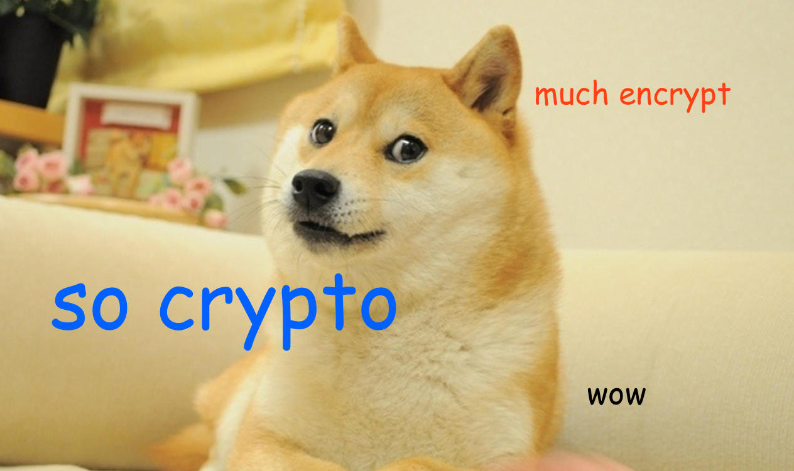

# cryptoparty



# FAQ

### What is a cryptoparty?

### What can I do to help?

### What is free software? 

### How secure is free software? 

### What is Tor?

### I don't have anything to hide. Why should I use cryptography?

# Installation Instructions 

## Mac OS X

**required** We'll use the Terminal a lot, so keep it in your Dock unless you already have it. Open the Terminal by typing `Cmd` + `space` and typing `Terminal` and hit `return`. Right-click and choose "Keep in Dock" as shown below. 


**optional** Things are much easier if you have the fantastic [homebrew](http://brew.sh) package manger installed. To install homebrew, you need to first install [XCode](https://developer.apple.com/xcode/downloads/). 

Then install brew by typing this into a Terminal window:

```bash
ruby -e "$(curl -fsSL https://raw.githubusercontent.com/Homebrew/install/master/install)"
```

and press `return`. Enter your password if prompted. 

### gpg

**If you have brew installed** type this into a Terminal window and press `return`

```bash
brew install gpg
```

**If you don't have brew installed** 

### TorBrowser

**If you have brew installed** type this into a Terminal window and press `return`

```bash
brew install caskroom/cask/brew-cask
brew cask install tor-browser
```

**If you don't have brew installed** 


### [Mailvelope](https://Mailvelope.com) for Chrome/Firefox


## *nix

If you're using a Linux, etc., I assume you know what you're doing. Please install:

* [gpg](https://www.gnupg.org/)
* TorBrowser

## Windows 

# How to Use Things 

## gpg 


# Resources and References 

