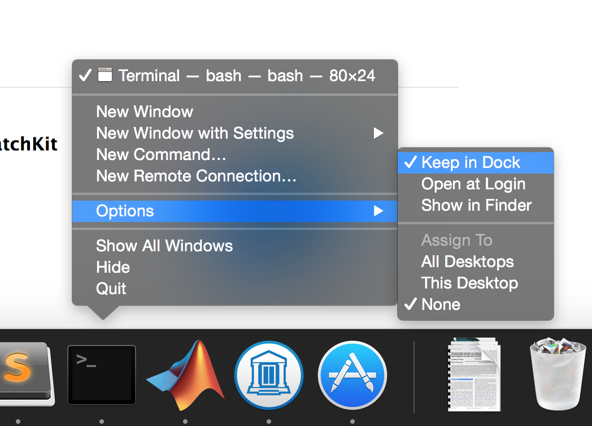
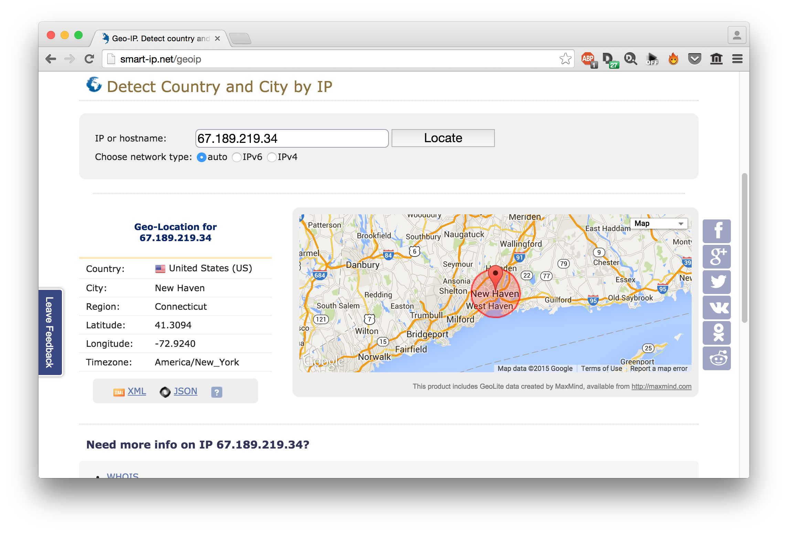
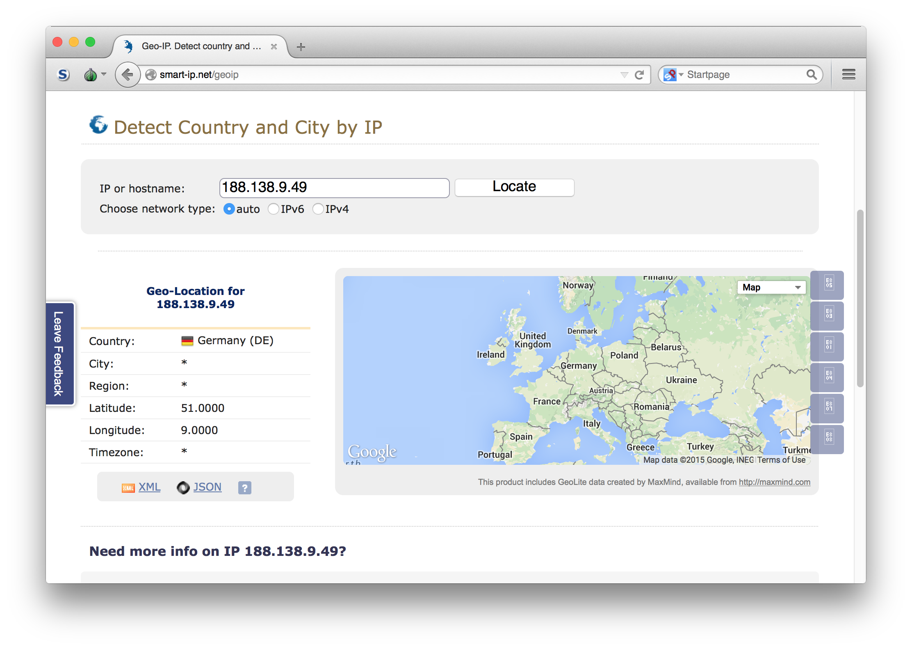

# cryptoparty


First things first: you will need to install two things for this cryptoparty.


# Installation Instructions 

This sections shows you how to install [gpg](https://www.gnupg.org/), which allows you to encrypt messages, and the [TorBrowser](https://www.torproject.org/), which anonymises your communication. 

## Mac OS X

We'll use the Terminal a lot, so keep it in your Dock. Open the Terminal by typing `Cmd` + `space` and typing `Terminal` and hit `return`. Right-click and choose "Keep in Dock" as shown below. 



### gpg

[GPGTools](https://gpgtools.org/) offers a convenient download that installs everything you need. 

### TorBrowser

Download it directly from [here](https://www.torproject.org/projects/torbrowser.html.en).


## Linux

If you're using Linux, etc., I assume you know what you're doing. Please install:

* [gpg](https://www.gnupg.org/)
* [TorBrowser](https://www.torproject.org/). 

## Windows 

### gpg

Download GPG4Win from [here](http://gpg4win.org/download.html) and install it. 

### TorBrowser

Download and install the TorBrowser [here](https://www.torproject.org/projects/torbrowser.html.en#windows).

# How to Use Stuff 

## gpg 

### Make a key

The first thing you want to do is to make a key. Open `Terminal` and type

```bash
gpg --gen-key
```
  
You will see something like this:

```bash
gpg (GnuPG) 1.4.18; Copyright (C) 2014 Free Software Foundation, Inc.
This is free software: you are free to change and redistribute it.
There is NO WARRANTY, to the extent permitted by law.

Please select what kind of key you want:
   (1) RSA and RSA (default)
   (2) DSA and Elgamal
   (3) DSA (sign only)
   (4) RSA (sign only)
Your selection?
```

Press `1` and `return`

You will then see this:

```bash
RSA keys may be between 1024 and 4096 bits long.
What keysize do you want? (2048)
```

Type `4096` (we want keys to be as hard to break as possible) and type `return`. The next prompt will be:

```bash
Requested keysize is 4096 bits       
Please specify how long the key should be valid.
         0 = key does not expire
      <n>  = key expires in n days
      <n>w = key expires in n weeks
      <n>m = key expires in n months
      <n>y = key expires in n years
Key is valid for? (0) 
```

Type `0` (because we don't want our keys to expire) and press `return`

```` bash
Key does not expire at all
Is this correct? (y/N)
````

Type `y` and then `return`. Follow the final steps through:

````bash
                        
You need a user ID to identify your key; the software constructs the user ID
from the Real Name, Comment and Email Address in this form:
    "Heinrich Heine (Der Dichter) <heinrichh@duesseldorf.de>"

Real name: Moo Cow
Email address: moo@cow.com
Comment:                  
You selected this USER-ID:
    "Moo Cow <moo@cow.com>"

Change (N)ame, (C)omment, (E)mail or (O)kay/(Q)uit? 
````

Press `O` for OK, then press `return`

````bash
You need a Passphrase to protect your secret key.    

We need to generate a lot of random bytes. It is a good idea to perform
some other action (type on the keyboard, move the mouse, utilize the
disks) during the prime generation; this gives the random number
generator a better chance to gain enough entropy.
.............+++++
....+++++
````

Finally, when everything is done, you'll see something like this:


````bash
gpg: /Users/moocow/.gnupg/trustdb.gpg: trustdb created
gpg: key E6A0F631 marked as ultimately trusted
public and secret key created and signed.

gpg: checking the trustdb
gpg: 3 marginal(s) needed, 1 complete(s) needed, PGP trust model
gpg: depth: 0  valid:   1  signed:   0  trust: 0-, 0q, 0n, 0m, 0f, 1u
pub   4096R/E6A0F631 2015-02-01
      Key fingerprint = 9DA8 5002 A98E 7217 8780  5FEF 6D61 F3FA E6A0 F631
uid                  Moo Cow <moo@cow.com>
sub   4096R/E4EFD8D3 2015-02-01
````

Excellent! We have now made a key that we can both to encrypt messages to other people (the private key), and that we can hand out to other people to encrypt messages to us (the public key).

### Export and publish your **public** key

First, ask `gpg` to show you what public keys you have using

```bash
gpg -k

/Users/moocow/.gnupg/pubring.gpg
- --------------------------------
pub   4096R/E6A0F631 2015-02-01
uid                  Moo Cow <moo@cow.com>
sub   4096R/E4EFD8D3 2015-02-01

```

And export the key you want using

```bash
gpg --armor --export moo@cow.com > moo.txt
```

The public key will be saved in a file called `moo.txt`. You should now distribute this key widely, for example, by uploading it to the [MIT key server](http://pgp.mit.edu/).

### Verify and import friend's key

After downloading a friend's key (say it's in a file called `doge.asc`), navigate to that folder and type:

```bash
gpg --with-fingerprint doge.asc
```

Verify that this fingerprint is correct by talking to your friend (or relying on a non-electronic channel of communication). If it's correct, import is using

```bash
gpg --import doge.asc
```

### Sign your friend's key

### Encrypt a message to a friend 

### Decrypt a message from a friend

### Sign a document 

There are two ways to sign a document: first, to wrap the document in a cryptographic signature, which necessarily modifies the document, or to create the signature in a separate file, using what is called a detached signature. Here, we will perform the first method, called a `clearsign`.

You will notice that this document is clear-signed with my private key. 

If you want to sign a plain-text document called `cowsay.txt`, do so with 

```bash
gpg --clearsign cowsay.txt
```

`gpg` will create a file called `cowsay.txt.asc` with the signature. You can rename and change the extension to whatever you want. 

### Verify a signed document 

Assuming you have a clearsigned document in `doge.txt.asc`, that has been signed by your friend, and you have his public key, you can verify that this document is legitimate using

``` bash
gpg --verify doge.txt.asc
```

and if you see something like:

```bash
gpg: Signature made Sun Feb  1 11:04:39 2015 EST using RSA key ID DOGE9999
gpg: Good signature from "The Doge <wow@doge.dog>" [unknown]
```

it means the signature and document are authentic. If on the other hand, you see something like this:

```bash
gpg: Signature made Sun Feb  1 11:09:26 2015 EST using RSA key ID DOGE9999
gpg: BAD signature from "The Doge <wow@doge.dog>" [unknown]
```

this means the document has been tampered with by a nefarious party. 

## tor 

Tor allows you to anonymise your activity on the internet. This means that if you visit a website, that website doesn't know where you're coming from. Without Tor, websites we visit know (among other things) where you live. Go to `http://smart-ip.net/geoip`  to see where that website thinks you live.



It seems to have a pretty good idea! Now, fire up `TorBrowser`. If everything is configured correctly, you should see this:


Now, if we visit `http://smart-ip.net/geoip` again, we see something else (your location will vary, as the Tor network will route you through a different node in the network):



Note that it got the country wrong, and the location detail it could pull out wasn't more specific than a whole country. 
