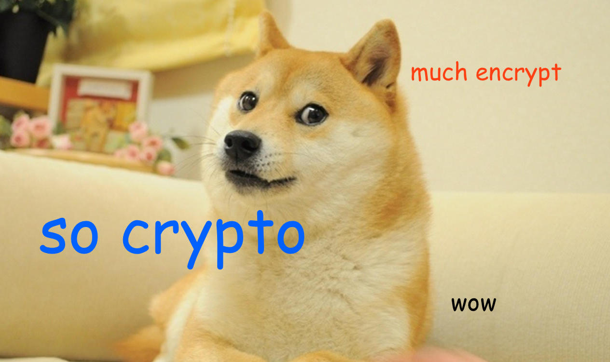
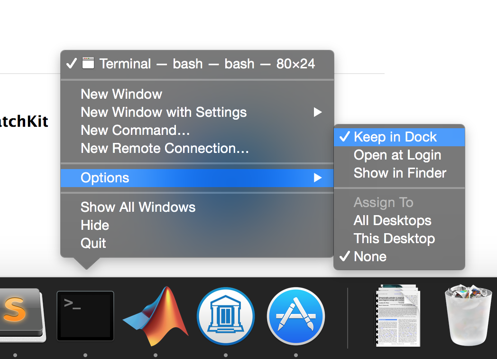
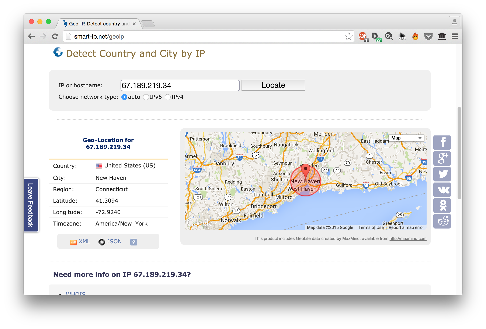
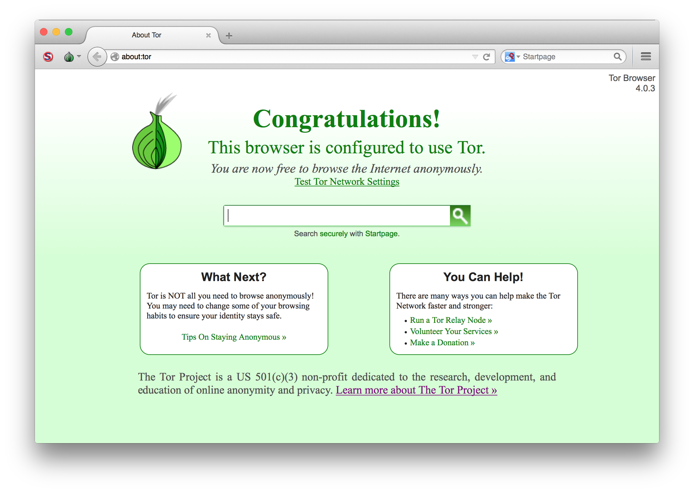
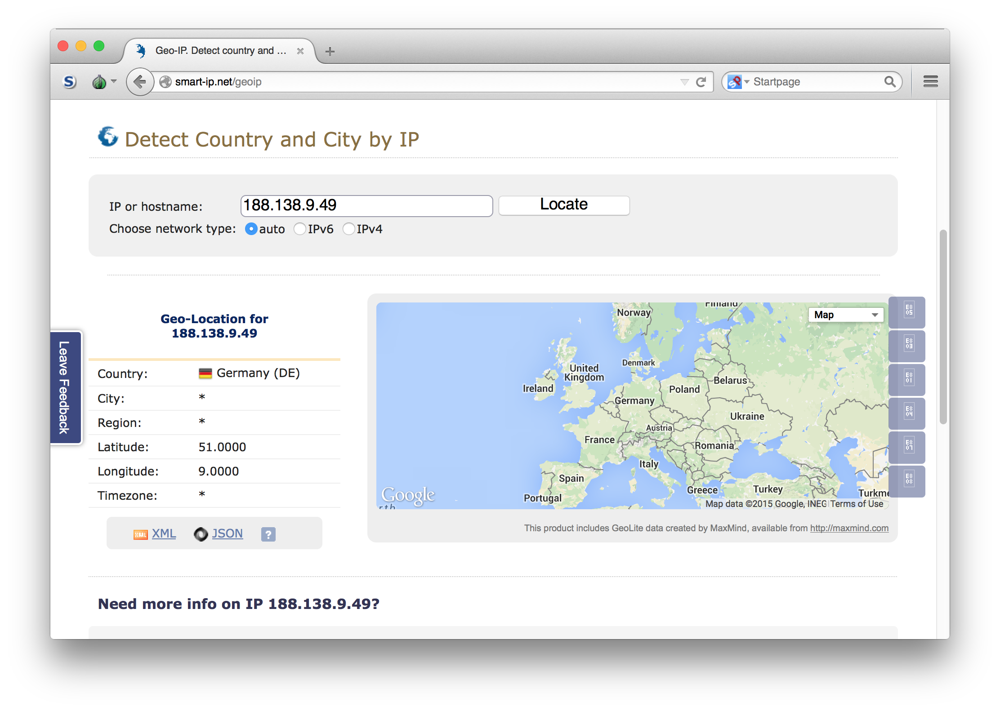

# cryptoparty



<!-- MarkdownTOC -->

- [FAQ](#faq)
  - [What is a cryptoparty?](#what-is-a-cryptoparty)
  - [Why should I go to a cryptoparty?](#why-should-i-go-to-a-cryptoparty)
  - [What is free software?](#what-is-free-software)
  - [How secure is free software?](#how-secure-is-free-software)
  - [I don't have anything to hide (so have nothing to fear). Why should I use cryptography?](#i-dont-have-anything-to-hide-so-have-nothing-to-fear-why-should-i-use-cryptography)
- [Facts about the Mass Surveillance](#facts-about-the-mass-surveillance)
  - [Lies by officials](#lies-by-officials)
  - [Surveillance by Companies](#surveillance-by-companies)
  - [Surveillance by governments](#surveillance-by-governments)
  - [Technology broken by mass surveillance](#technology-broken-by-mass-surveillance)
  - [Technology that we know that the NSA can't break (yet)](#technology-that-we-know-that-the-nsa-cant-break-yet)
- [Installation Instructions](#installation-instructions)
  - [Mac OS X](#mac-os-x)
    - [gpg](#gpg)
    - [TorBrowser](#torbrowser)
  - [Linux](#linux)
  - [Windows](#windows)
    - [gpg](#gpg-1)
    - [TorBrowser](#torbrowser-1)
- [How to Use Stuff](#how-to-use-stuff)
  - [gpg](#gpg-2)
    - [Make a key](#make-a-key)
    - [Export and publish your **public** key](#export-and-publish-your-public-key)
    - [Verify and import friend's key](#verify-and-import-friends-key)
    - [Sign your friend's key](#sign-your-friends-key)
    - [Encrypt a message to a friend](#encrypt-a-message-to-a-friend)
    - [Decrypt a message from a friend](#decrypt-a-message-from-a-friend)
    - [Sign a document](#sign-a-document)
    - [Verify a signed document](#verify-a-signed-document)
  - [tor](#tor)
- [Further Reading and Resources](#further-reading-and-resources)
  - [Videos](#videos)
  - [Key Essays](#key-essays)
  - [Books](#books)
  - [Links](#links)
  - [Software](#software)
  - [Services](#services)
- [License](#license)

<!-- /MarkdownTOC -->


# FAQ

### What is a cryptoparty?

According to [Wikipedia](https://en.wikipedia.org/wiki/Cryptoparty),

> A CryptoParty is a grassroots global endeavour to introduce the basics of practical cryptography such as the Tor anonymity network, key signing parties, disk encryption and virtual private networks to the general public. The project primarily consists of a series of free public workshops.

### Why should I go to a cryptoparty?

* because it's fun
* to learn about the reality and dangers of mass surveillance 
* to learn some really cool mathematical concepts
* to learn how to use free software to protect your freedom

### What is free software? 

[Free software](http://www.fsf.org/about/what-is-free-software) is software that gives you, the user, the freedom to share, study and modify it. Free software is necessary for computer security: *only* with free software can security be based not on blind trust, but on verifiable facts. 

We use the word "free" here as in "freedom", not as in "free beer". 

### How secure is free software? 

The *most* secure. Non-free software doesn't allow independent, free audits, meaning you have no guarantee that it works in the way advertised. Non-free software doesn't let you patch security holes in them, leaving you at the mercy of the original author.  

### I don't have anything to hide (so have nothing to fear). Why should I use cryptography?

1. **Laws change, but surveillance data is immortal.** For example, you may agree to cameras in every home to prevent domestic violence ("and domestic violence only") - but the next day, a new political force in power could decide that homosexuality will again be illegal, and they will use the existing home cameras to enforce their new rules. Any surveillance must be regarded in terms of how it can be abused by a worse power than today's.
2. **Laws must be broken for society to change.** Less than a human lifetime ago, if you were born a homosexual, you were criminal from birth in the US. If today’s surveillance level had existed in the 1950s and 60s, the lobby groups for sexual equality could never have formed; it would have been just a matter of rounding up the organized criminals ("and who could possibly object to fighting organized crime?"). If today's surveillance level had existed in the 1950s and 60s, homosexuality would still be illegal and homosexual people would be criminals by birth. 
3. **Privacy is a [fundamental](http://www.un.org/en/documents/udhr/) human right.** Privacy is a basic human need: Implying that only the dishonest people have need of any privacy ignores a basic property of the human psyche, and sends a creepy message of strong discomfort. We have a fundamental need for privacy. I lock the door when I go to the men’s room, despite the fact that nothing secret happens in there. 
4. **Surveillance is a one-way street that reinforces power.** Mass surveillance maintains and concentrates power; those who surveil are often those who declare themselves beyond public accountability.

# Facts about the Mass Surveillance 

## Lies by officials 

## Surveillance by Companies

## Surveillance by governments

## Technology broken by mass surveillance 

1. A number of algorithms, protocols and cryptographic technologies, especially many supported by the [NIST](http://en.wikipedia.org/wiki/National_Institute_of_Standards_and_Technology). The NSA, through a programme called [BULLRUN](http://en.wikipedia.org/wiki/Bullrun_(decryption_program)), inserted a backdoor into a NIST-supported random number generator called [Dual_EC_DRBG](http://en.wikipedia.org/wiki/Dual_EC_DRBG). 
2. VPNs, SSL/TLS, S/MIME, PPTP, IPSec [NSA slides](http://www.spiegel.de/media/media-35515.pdf)
3. Any security system you have to pay money for and whose code you can't see has been broken. 

## Technology that we know that the NSA can't break (yet)

1. OTR [NSA intercepts](http://www.spiegel.de/media/media-35552.pdf)
2. PGP/GnuPG [NSA intercepts](http://www.spiegel.de/media/media-35545.pdf) 
3. Tor [NSA slides](http://www.theguardian.com/world/interactive/2013/oct/04/tor-stinks-nsa-presentation-document)

That's it. There is nothing else. 


# Installation Instructions 

This sections shows you how to install [gpg](https://www.gnupg.org/), which allows you to encrypt messages, and the [TorBrowser](https://www.torproject.org/), which anonymises your communication. 

## Mac OS X

**required** We'll use the Terminal a lot, so keep it in your Dock. Open the Terminal by typing `Cmd` + `space` and typing `Terminal` and hit `return`. Right-click and choose "Keep in Dock" as shown below. 



**optional** Things are much easier if you have the fantastic [homebrew](http://brew.sh) package manger installed. To install homebrew, you need to first install [XCode](https://developer.apple.com/xcode/downloads/). 

Then install brew by typing this into a Terminal window:

```bash
ruby -e "$(curl -fsSL https://raw.githubusercontent.com/Homebrew/install/master/install)"
```

### gpg

[GPGTools](https://gpgtools.org/) offers a convenient download that installs everything you need. 

Attention `homebrew` users! `brew install gpg` installs an old "portable" version of gpg (1.4.18), while GPGTools installs the latest stable version (2.0.26). To install the latest stable version, use:

```bash
brew install gnupg2
```

or if you want the *really* modern version with ECC, use:

```bash
brew install homebrew/versions/gnupg21
```

### TorBrowser

**If you have brew installed** type this into a Terminal window and press `return`

```bash
brew install caskroom/cask/brew-cask
brew cask install tor-browser
```

**If you don't have brew installed** 

Download it directly from [here](https://www.torproject.org/projects/torbrowser.html.en).


## Linux

If you're using Linux, etc., I assume you know what you're doing. Please install:

* [gpg](https://www.gnupg.org/)
* [TorBrowser](https://www.torproject.org/). 

## Windows 

### gpg

Download GPG4Win from [here](http://gpg4win.org/download.html) and install it. 

### TorBrowser

Download and install the TorBrowser [here](https://www.torproject.org/projects/torbrowser.html.en#windows).

# How to Use Stuff 

## gpg 

### Make a key

The first thing you want to do is to make a key. Open `Terminal` and type

```bash
gpg --gen-key
```
  
You will see something like this:

```
gpg (GnuPG) 1.4.18; Copyright (C) 2014 Free Software Foundation, Inc.
This is free software: you are free to change and redistribute it.
There is NO WARRANTY, to the extent permitted by law.

Please select what kind of key you want:
   (1) RSA and RSA (default)
   (2) DSA and Elgamal
   (3) DSA (sign only)
   (4) RSA (sign only)
Your selection?
```

Press `1` and `return`

You will then see this:

```bash
RSA keys may be between 1024 and 4096 bits long.
What keysize do you want? (2048)
```

Type `4096` (we want keys to be as hard to break as possible) and type `return`. The next prompt will be:

```bash
Requested keysize is 4096 bits       
Please specify how long the key should be valid.
         0 = key does not expire
      <n>  = key expires in n days
      <n>w = key expires in n weeks
      <n>m = key expires in n months
      <n>y = key expires in n years
Key is valid for? (0) 
```

Type `0` (because we don't want our keys to expire) and press `return`

```` bash
Key does not expire at all
Is this correct? (y/N)
````

Type `y` and then `return`. Follow the final steps through:

````bash
                        
You need a user ID to identify your key; the software constructs the user ID
from the Real Name, Comment and Email Address in this form:
    "Heinrich Heine (Der Dichter) <heinrichh@duesseldorf.de>"

Real name: Moo Cow
Email address: moo@cow.com
Comment:                  
You selected this USER-ID:
    "Moo Cow <moo@cow.com>"

Change (N)ame, (C)omment, (E)mail or (O)kay/(Q)uit? 
````

Press `O` for OK, then press `return`

````bash
You need a Passphrase to protect your secret key.    

We need to generate a lot of random bytes. It is a good idea to perform
some other action (type on the keyboard, move the mouse, utilize the
disks) during the prime generation; this gives the random number
generator a better chance to gain enough entropy.
.............+++++
....+++++
````

Finally, when everything is done, you'll see something like this:


````bash
gpg: /Users/moocow/.gnupg/trustdb.gpg: trustdb created
gpg: key E6A0F631 marked as ultimately trusted
public and secret key created and signed.

gpg: checking the trustdb
gpg: 3 marginal(s) needed, 1 complete(s) needed, PGP trust model
gpg: depth: 0  valid:   1  signed:   0  trust: 0-, 0q, 0n, 0m, 0f, 1u
pub   4096R/E6A0F631 2015-02-01
      Key fingerprint = 9DA8 5002 A98E 7217 8780  5FEF 6D61 F3FA E6A0 F631
uid                  Moo Cow <moo@cow.com>
sub   4096R/E4EFD8D3 2015-02-01
````

Excellent! We have now made a key that we can both to encrypt messages to other people (the private key), and that we can hand out to other people to encrypt messages to us (the public key).

### Export and publish your **public** key

First, ask `gpg` to show you what public keys you have using

```bash
gpg -k

/Users/moocow/.gnupg/pubring.gpg
- --------------------------------
pub   4096R/E6A0F631 2015-02-01
uid                  Moo Cow <moo@cow.com>
sub   4096R/E4EFD8D3 2015-02-01

```

And export the key you want using

```bash
gpg --armor --export moo@cow.com > moo.txt
```

The public key will be saved in a file called `moo.txt`. You should now distribute this key widely, for example, by uploading it to the [MIT key server](http://pgp.mit.edu/).

### Verify and import friend's key

After downloading a friend's key (say it's in a file called `doge.asc`), navigate to that folder and type:

```bash
gpg --with-fingerprint doge.asc
```

Verify that this fingerprint is correct by talking to your friend (or relying on a non-electronic channel of communication). If it's correct, import is using

```bash
gpg --import doge.asc
```

### Sign your friend's key

### Encrypt a message to a friend 

### Decrypt a message from a friend

If a message from a friend is in `secret.txt`, decrypt it using:

```bash
gpg -d secret.txt
```

### Sign a document 

There are two ways to sign a document: first, to wrap the document in a cryptographic signature, which necessarily modifies the document, or to create the signature in a separate file, using what is called a detached signature. Here, we will perform the first method, called a `clearsign`.

You will notice that this document is clear-signed with my private key. 

If you want to sign a plain-text document called `cowsay.txt`, do so with 

```bash
gpg --clearsign cowsay.txt
```

`gpg` will create a file called `cowsay.txt.asc` with the signature. You can rename and change the extension to whatever you want. 

### Verify a signed document 

Assuming you have a clearsigned document in `doge.txt.asc`, that has been signed by your friend, and you have his public key, you can verify that this document is legitimate using

``` bash
gpg --verify doge.txt.asc
```

and if you see something like:

```bash
gpg: Signature made Sun Feb  1 11:04:39 2015 EST using RSA key ID DOGE9999
gpg: Good signature from "The Doge <wow@doge.dog>" [unknown]
```

it means the signature and document are authentic. If on the other hand, you see something like this:

```bash
gpg: Signature made Sun Feb  1 11:09:26 2015 EST using RSA key ID DOGE9999
gpg: BAD signature from "The Doge <wow@doge.dog>" [unknown]
```

this means the document has been tampered with by a nefarious party. 

## tor 

Tor allows you to anonymise your activity on the internet. This means that if you visit a website, that website doesn't know where you're coming from. Without Tor, websites we visit know (among other things) where you live. Go to `http://smart-ip.net/geoip`  to see where that website thinks you live.



It seems to have a pretty good idea! Now, fire up `TorBrowser`. If everything is configured correctly, you should see this:



Now, if we visit `http://smart-ip.net/geoip` again, we see something else (your location will vary, as the Tor network will route you through a different node in the network):



Note that it got the country wrong, and the location detail it could pull out wasn't more specific than a whole country. 

# Further Reading and Resources

## Videos

* [Citizenfour](https://en.wikipedia.org/wiki/Citizenfour) Laura Poitras' award winning documentary on Edward Snowden. This is free to watch and download on the [Internet Archive](https://archive.org/details/LauraPoitrasCitizenfour).
* [Selma](http://www.imdb.com/title/tt1020072/). *Selma* is really a movie about surveillance. MLK was the target of an [intensive surveillance campaign](http://en.wikipedia.org/wiki/Mass_surveillance_in_the_United_States#cite_note-Church-23) by the FBI to "neutralize" him as an effective civil rights activist. A FBI memo recognized King to be the "most dangerous and effective Negro leader in the country.", and the agency wanted to discredit him by collecting evidence to (unsuccessfully) prove that he had been influenced by [communism](http://edition.cnn.com/2008/US/03/31/mlk.fbi.conspiracy/).
* [GPG For Journalists](http://vimeo.com/56881481) Interesting for its historic significance, this video was made by Edward Snowden in a (futile) attempt to get a [journalist](https://firstlook.org/theintercept/staff/glenn-greenwald/) to use GPG. More than anything, this illustrates the complexity of security software and its resultant [inaccessibility](https://media.ccc.de/browse/congress/2014/31c3_-_6021_-_en_-_saal_g_-_201412281130_-_why_is_gpg_damn_near_unusable_-_arne_padmos.html). 
* [Free software, free society: Richard Stallman at TEDxGeneva 2014](https://www.youtube.com/watch?v=Ag1AKIl_2GM). Richard Stallman talking about free software and why it matters. A good introduction to the Free Software Movement. 
* [Bruce Schneier in conversation with Edward Snowden](https://www.youtube.com/watch?v=7Ui3tLbzIgQ).


## Key Essays

* [You and the Atomic Bomb](http://orwell.ru/library/articles/ABomb/english/e_abomb)
* [A Cypherpunk's Manifesto](http://www.activism.net/cypherpunk/manifesto.html)
* [Guerilla Open Access Manifesto ](https://archive.org/stream/GuerillaOpenAccessManifesto/Goamjuly2008_djvu.txt)
* [Who Should Own the Internet](http://www.nytimes.com/2014/12/04/opinion/julian-assange-on-living-in-a-surveillance-society.html)
* [Debunking the dangerous nothing to hide nothing to fear](http://falkvinge.net/2012/07/19/debunking-the-dangerous-nothing-to-hide-nothing-to-fear/)
* [Ed Snowden Taught Me To Smuggle Secrets Past Incredible Danger. Now I Teach You](https://firstlook.org/theintercept/2014/10/28/smuggling-snowden-secrets/) A fascinating first-hand account by Micah Lee on how he helped journalists communicate securely. 

## Books

* [The GPG Privacy Handbook](https://www.gnupg.org/gph/en/manual.html) The definitve guide to using GPG
* [When Google Met Wikileaks](http://www.orbooks.com/catalog/when-google-met-wikileaks/)
* [Cypherpunks](http://www.orbooks.com/catalog/cypherpunks/)
* [This Machine Kills Secrets](http://www.thismachinekillssecrets.com/)
* [The Traveller](https://en.wikipedia.org/wiki/The_Traveler_%28novel%29) This fictional book's major theme living within a [Panopticon](https://en.wikipedia.org/wiki/Panopticon), or a world of universal surveillance. 

## Links
* [The EFF's PanoptiClick](https://panopticlick.eff.org/)
* [Prism Break](https://prism-break.org/en/) A database of software and services you can switch to to maximise the cost of spying on you.
* [Blender](https://addons.mozilla.org/en-us/firefox/addon/blender-1/) Firefox plugin that spoofs common browser configurations.  
* [The Cryptoparty homepage](https://www.cryptoparty.in/index)
* [The MIT Key Server](http://pgp.mit.edu/)
* [The NSA Files Decoded](http://www.theguardian.com/world/interactive/2013/nov/01/snowden-nsa-files-surveillance-revelations-decoded#section/1) A *Guardian* special feature on mass surveillance by the NSA. 

## Software

* [OTR](https://otr.cypherpunks.ca/). OTR, or Off-the-record allows you to encrypt instant messaging 
* [TAILS](https://tails.boum.org/). Tails is a hardened live operating system that routes everything over Tor and allows no local changes. 
* [Firefox](https://www.mozilla.org/en-US/firefox/new/). The most widely used free browser. 
* [HTTPS Everywhere](https://www.eff.org/https-everywhere) A plugin made by EFF to force encrypted connections in the browser

## Services

* [disconnect.me](https://disconnect.me/) A search engine that claims to respect your privacy.
* [DuckDuckGo](https://duckduckgo.com/) Another search engine that claims to respect your privacy.
* [BitTorrent Sync](http://www.getsync.com/) An alternative to Dropbox that uses the P2P BitTrorrent technology to synchronise computers. The actual app is closed source. 

# License 

Public Domain. 
